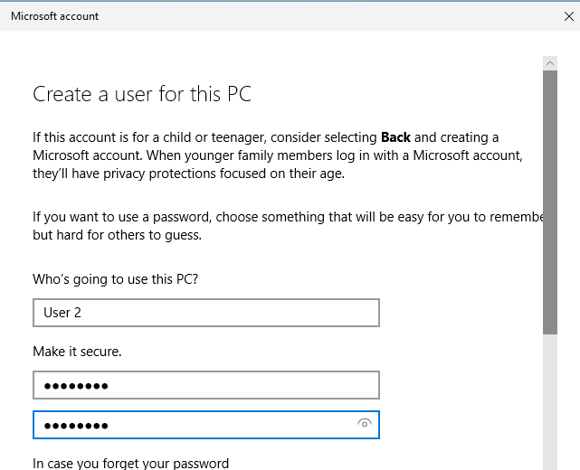
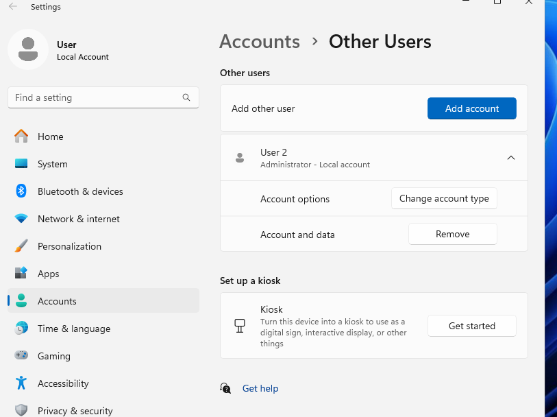
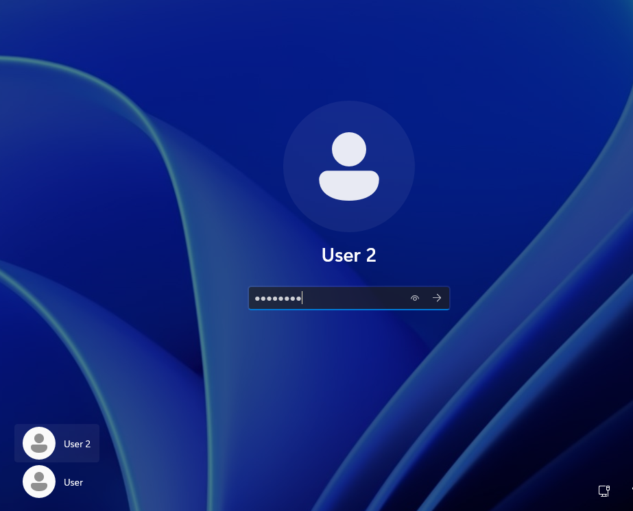
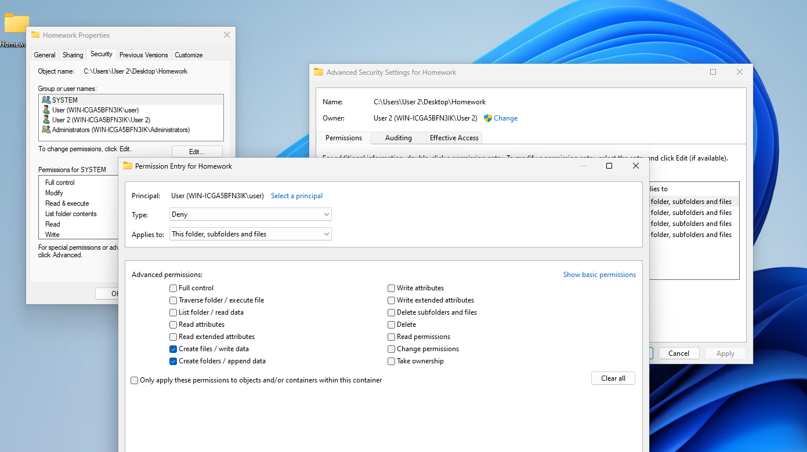
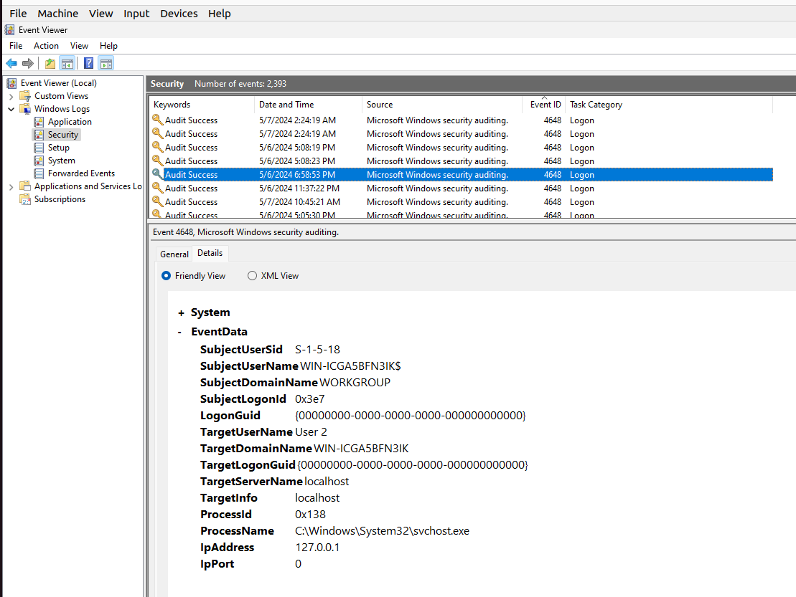
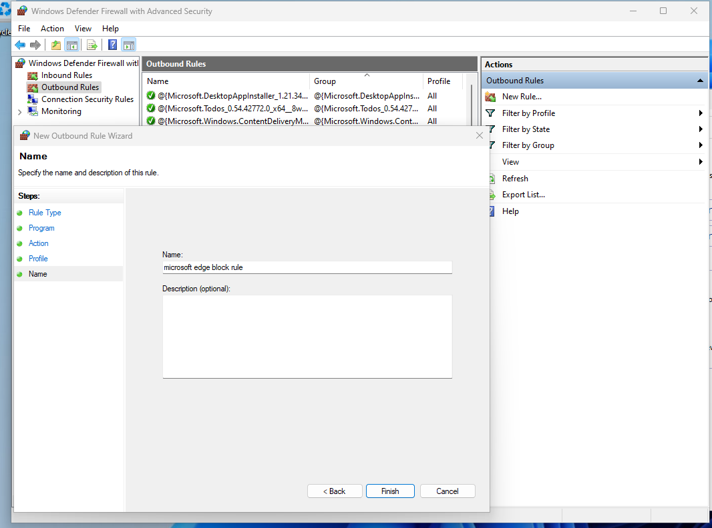
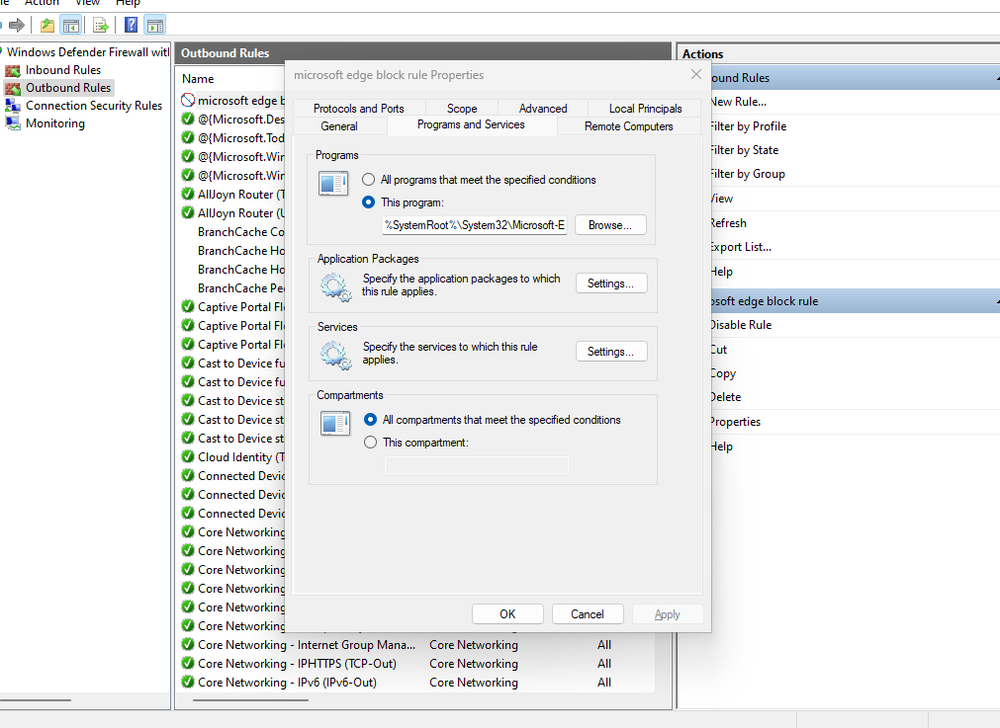
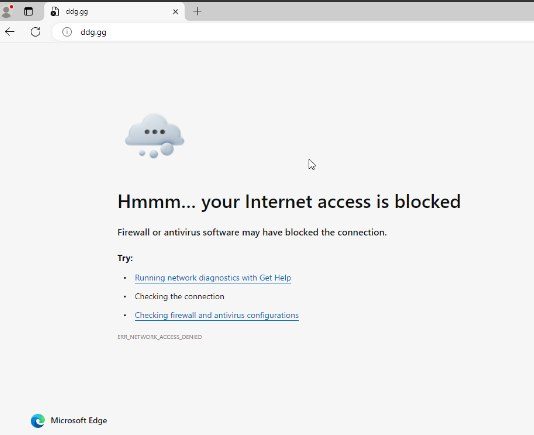

# ПРАКТИЧЕСКОЕ ЗАДАНИЕ

Создать учётную запись User2. Сделать скриншот.

Для учётной записи User2 назначить права администратора.

Авторизоваться под учётной записью User2.

Создать папку «ДЗ» на рабочем столе. Сделать настройки для папки «ДЗ», запрещающие создавать в папке файлы и подпапки пользователю User. 
Сделать скриншоты, подтверждающие выставление соответствующего требования.

В окне «Управление компьютером» открыть журнал «Просмотр событий» → «Сводка административных событий» → «Аудит успеха», сделать скриншот, подтверждающий авторизации под учётной записью User2. 

В защитнике Microsoft Defender добавьте исключение, запрещающее подключение к сети Интернет для Microsoft Edge. Приложить скриншот.

